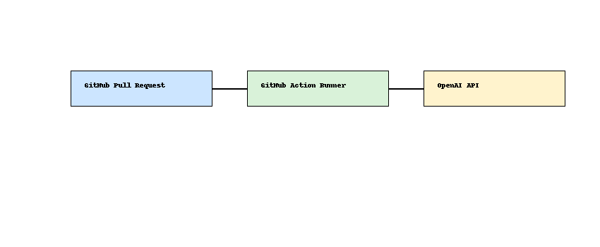

# GenAI Code Review Assistant 🤖📋

A GitHub Action that uses OpenAI to review code changes and comment inline on pull requests.

## 🔍 Features

- Summarizes changes in PRs
- Detects bugs, style issues, and edge cases
- Comments inline using GitHub API
- Built with Python + GitHub Actions

## 🧠 Architecture

## 📁 Structure

- `.github/workflows/` – GitHub Actions YAML
- `scripts/` – Python script for analyzing diffs and calling OpenAI
- `README.md` – Setup instructions

## 🚀 Setup

1. Set up GitHub repository secrets:
   - `OPENAI_API_KEY`
   - `GH_TOKEN` (GitHub token with `repo` scope)

2. The action runs automatically on each pull request.

