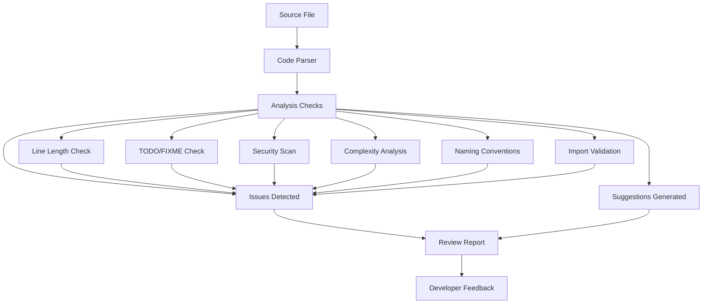

# GenAI Code Review Assistant

An advanced AI-powered code review helper using static analysis. The script analyzes code for issues like complexity, naming conventions, security vulnerabilities, and provides actionable suggestions.


```mermaid
flowchart TD
    File[Source File] --> Parser[Code Parser]
    Parser --> Checks[Analysis Checks]
    Checks --> Issues[Issues Detected]
    Checks --> Suggestions[Suggestions Generated]

    Checks --> LineLength[Line Length Check]
    Checks --> TodoCheck[TODO/FIXME Check]
    Checks --> SecurityCheck[Security Scan]
    Checks --> ComplexityCheck[Complexity Analysis]
    Checks --> NamingCheck[Naming Conventions]
    Checks --> ImportCheck[Import Validation]

    LineLength --> Issues
    TodoCheck --> Issues
    SecurityCheck --> Issues
    ComplexityCheck --> Issues
    NamingCheck --> Issues
    ImportCheck --> Issues

    Issues --> Report[Review Report]
    Suggestions --> Report

    Report --> User[Developer Feedback]
```

## 📂 Structure

```
genai-code-review-assistant/
├── README.md
├── requirements.txt
├── examples/
│   └── sample.diff        # Sample diff for demoing AI review offline
├── scripts/
│   └── review.py          # Static analyzer (AST) + AI diff reviewer
└── .github/workflows/
    └── genai-review.yml   # Runs the AI review on pull requests
```

## 🚀 Usage

### Static analysis of a file

```bash
python scripts/review.py path/to/file.py
```

Analyzes Python files for code quality, security, and best practices.

### AI review of a diff

```bash
export ANTHROPIC_API_KEY=sk-ant-...          # optional: ANTHROPIC_MODEL (default: claude-sonnet-5)
python scripts/review.py --diff examples/sample.diff
```

Sends the unified diff to the Anthropic API and prints a review with
"Issues Found" and "Suggestions" sections. Without an API key (or with
`--dry-run`) it prints an offline mock review, so the demo works anywhere.
The GitHub Actions workflow runs this automatically on every pull request
using the `ANTHROPIC_API_KEY` repository secret.

## 🏗️ Analysis Features

- **Syntax Validation**: AST-based parsing for Python files
- **Code Complexity**: Function/class size checks
- **Naming Conventions**: Enforces snake_case/PascalCase
- **Security Scanning**: Detects potential vulnerabilities
- **Import Analysis**: Identifies unused imports
- **Line Length & TODO Checks**: Basic style validation

## 📜 License

MIT License
