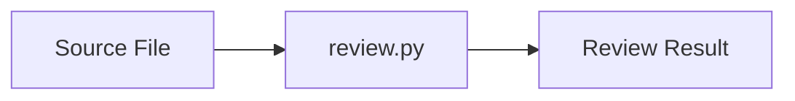

# GenAI Code Review Assistant

A minimal AI-powered code review helper. The script takes a filename and prints a basic review comment.


```mermaid
flowchart LR
    File[Source File] --> Script[review.py]
    Script --> Output[Review Result]
```

## 📂 Structure

```
genai-code-review-assistant/
├── README.md
├── requirements.txt
└── scripts/
    └── review.py
```

## 🚀 Usage

```bash
python scripts/review.py path/to/file.py
```

## 📜 License

MIT License
