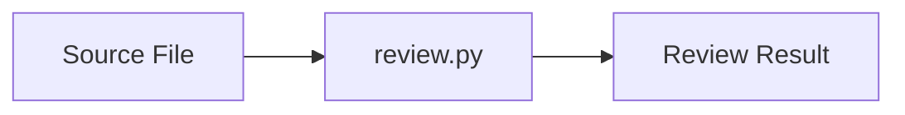

# GenAI Code Review Assistant

A minimal AI-powered code review helper. The script takes a filename, performs a few heuristic checks (empty file, TODO/FIXME comments, overly long lines), and prints feedback. This simulates the sort of simple suggestions a real code review model might offer.


```mermaid
flowchart LR
    File[Source File] --> Script[review.py]
    Script --> Output[Review Result]
```

## 📂 Structure

```
genai-code-review-assistant/
├── README.md
├── requirements.txt
└── scripts/
    └── review.py
```

## 🚀 Usage

```bash
python scripts/review.py path/to/file.py
```

## 📜 License

MIT License
